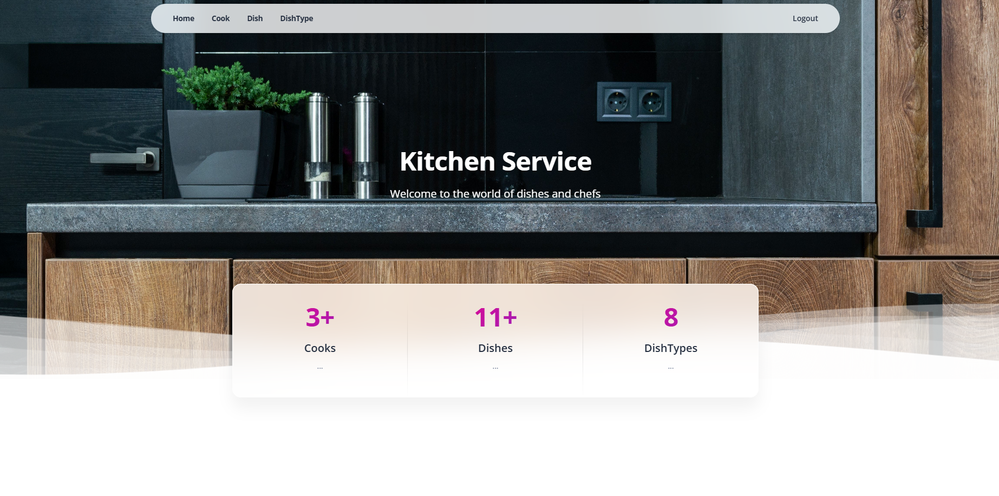

# Kitchen Service

Django project for managing cooks, dishes and dish categories in a restaurant kitchen.

## Check it out!

[Kitchen Service deployed to Render](https://kitchen-service-tomekszatal.onrender.com/cooks/)

## Installation

Python3 must be already installed

```shell
git clone https://github.com/TomekSzatal/kitchen-service
cd kitchen-service
python3 -m venv .venv
source .venv/bin/activate
pip install -r requirements.txt
python manage.py migrate
python manage.py createsuperuser
python manage.py runserver  # starts Django Server
```

## Features

* Authentication functionality for Cook/User
* Managing cooks directly from website interface
* Managing dishes and dish categories
* Assigning cooks to dishes
* Search functionality for cooks and dishes
* Detailed information pages for cooks and dishes
* Powerful admin panel for advanced managing

## Demo


